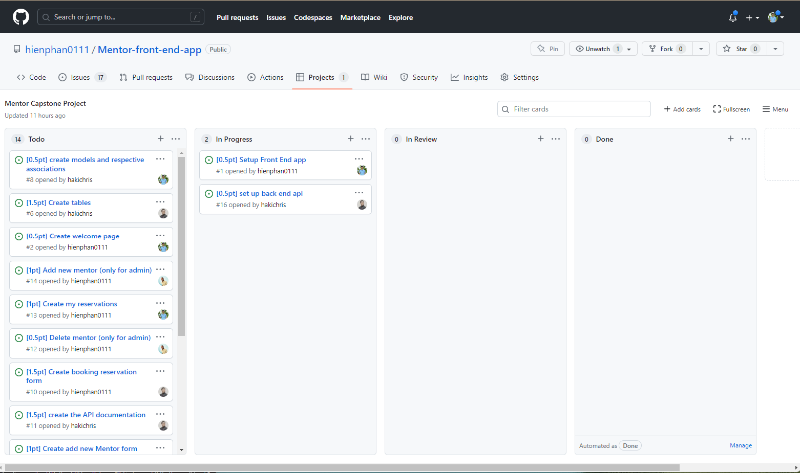
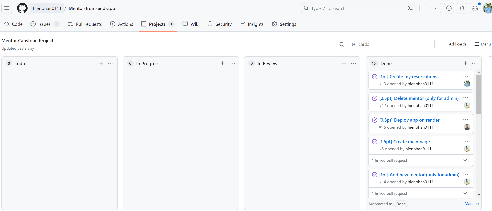

<a name="readme-top"></a>

<div align="center">

  
  <br/>

  <h3><b>Mentor front end app</b></h3>

</div>

<!-- TABLE OF CONTENTS -->

# 📗 Table of Contents

- [📖 About the Project](#about-project)
  - [🛠 Features](#features)
  - [🛠 Built With](#built-with)
  - [🛠 Kanban board](#kanban-board)
  - [🚀 Live Demo](#live-demo)
- [💻 Getting Started](#getting-started)
  - [Setup](#setup)
  - [Prerequisites](#prerequisites)
  - [Install](#install)
  - [Usage](#usage)
  - [Run tests](#run-tests)
  - [Deployment](#triangular_flag_on_post-deployment)
- [👥 Authors](#authors)
- [🔭 Future Features](#🔭-future-features)
- [🤝 Contributing](#🤝-contributing)
- [🙏 Acknowledgments](#🙏-acknowledgments)
- [📝 License](#📝-license)


<!-- PROJECT DESCRIPTION -->

# 📖 Mentor app <a name="about-project"></a>

This App allow users book reservations with their mentors.
This repo host front-end app. [Click here](https://github.com/hakichris/mentor-back-end) to access the back-end app

## 🔭 Features <a name="features"></a>
- [ ] **Sign in && Sigup**
- [ ] **Book reservation**
- [ ] **Show their reservations**
- [ ] **Delete their reservations**
- [ ] **Admin features**

## 🛠 Built With <a name="built-with"></a>

* [![React][React.js]][React-url]
* [![Redux][redux.js]][Redux-url]
* [![TailwindCSS][TailwindCSS][tailwind-url]]

## 🛠 Kanban board <a name="kanban-board"></a>

For management this project, we setup kanban board in which we split project into a bundle of tasks and balanced for all team members. [Click here](https://github.com/hienphan0111/Mentor-front-end-app/projects/1) to overview this kanban board.
- Screen shots of Kanban board:
  - Init project:
  <div align="center">
    
  <div>
  <br />
  - Final status:
  <div align="center">
    
  <div>

- All members have completed their tasks on time.

<p align="right">(<a href="#readme-top">back to top</a>)</p>

## 🚀 Live Demo <a name="live-demo"></a>
To see the demo version, you can <a href=""> - [Clik here](https://mentor-app-qxn4.onrender.com) </a>
- Want to try admin features, use below account:
```bash
username: admin@gmail.com
password: 123456
```

<!-- GETTING STARTED -->

## 💻 Getting Started <a name="getting-started"></a>

To get a local copy up and running, follow these steps.

### Prerequisites

- IDE(code editor) like: **Vscode**, **Sublime**, etc. 
- [Git](https://www.linode.com/docs/guides/how-to-install-git-on-linux-mac-and-windows/)

### Setup

1. Download the **Zip** file or clone the repo with:
```bash
git clone https://github.com/hienphan/mentor-front-end-app.git
```
3. To access cloned directory run:
```bash
cd mentor-front-end-app
```
3. Open it with the live server

### Install

> To install linters and other project's dependencies run:
```bash
yarn
```

4. Get Client_id and Client_Secret

- Clone back-end api 
```bash
git clone https://github.com/hakichris/mentor-back-end.git
```
- Run
```bash
bundle install
```

- Run command below to create client_id and secret on your local database
```bash
rails console
```
- Then create an OAuth application using this command :
```bash
oauth = Doorkeeper::Application.create(name: "Web client", redirect_uri: "", scopes: "")
```
- You can change the name to any name you want, and leave redirect_uri and scopes blank.

- Then run below command to get client_id
```bash
oauth.uid
```

- Get client_secret by below command
```bash
oauth.secret
```

- Finnaly, create .env file in the root folder with content:
```bash
VITE_CLIENT_ID=client_id
VITE_CLIENT_SECRET=client_secret
```
replace client_id and client_secret with info that you got above

- To use admin features, you can create an account on front end then run `rails console`
- Find the user that you just created and set isAdmin to true, example:
```bash
user = User.find_by(email: "email@email.com")
user.isAdmin = true
user.save
```
- Comeback your front end and login again
- The Admin features should appear on your side bar.

### Usage

To run the project, execute the following command:

```bash
yarn dev
```
<!--
Example command:

```sh
  rails server
```
--->

### Run tests

To run tests, run the following command:

<!--
Example command:

```sh
  bin/rails test test/models/article_test.rb
```
--->

<p align="right">(<a href="#readme-top">back to top</a>)</p>

<!-- AUTHORS -->

## 👥 Authors <a name="authors"></a>

👤 **Hien Phan**
- GitHub: [@hienphan0111](https://github.com/hienphan0111)
- Twitter: [@hienphan0111](https://twitter.com/twitterhandle)
- LinkedIn: [LinkedIn](https://www.linkedin.com/in/hien-phan-61097b256/)

👤 **Christian Hakizimana**

- GitHub: [@githubhandle](https://github.com/hakichris)
- Twitter: [@twitterhandle](https://twitter.com/twitterhandle)
- LinkedIn: [@LinkedInhandle](https://linkedin.com/in/hakichris)


👤 **Donald Akite**

- GitHub: [@githubhandle](https://github.com/quavo19)
- Twitter: [@twitterhandle](https://twitter.com/DonaldAkite)
- LinkedIn: [LinkedIn](https://www.linkedin.com/in/donald-akite-299a31222/)

<p align="right">(<a href="#readme-top">back to top</a>)</p>

<!-- FUTURE FEATURES -->

## 🔭 Future Features <a name="future-features"></a>

- [ ] **User login**


<p align="right">(<a href="#readme-top">back to top</a>)</p>

<!-- CONTRIBUTING -->

## 🤝 Contributing <a name="contributing"></a>

Contributions, issues, and feature requests are welcome!

Feel free to check the [issues page](../../issues/).

<p align="right">(<a href="#readme-top">back to top</a>)</p>

<!-- ACKNOWLEDGEMENTS -->

## 🙏 Acknowledgments <a name="acknowledgements"></a>

I would like to thank Microverse
And I would like to thank Murat Korkmaz on Behance for his design
<p align="right">(<a href="#readme-top">back to top</a>)</p>

<!-- FAQ (optional) -->

## 📝 License <a name="license"></a>

This project is contributed under [GNU 3.0](./LICENSE.md) and [Creative commons](https://creativecommons.org/licenses/by-nc/4.0/) licensed


<p align="right">(<a href="#readme-top">back to top</a>)</p>

<!-- MARKDOWN LINKS & IMAGES -->
<!-- https://www.markdownguide.org/basic-syntax/#reference-style-links -->
[React.js]: https://img.shields.io/badge/React-20232A?style=for-the-badge&logo=react&logoColor=61DAFB
[React-url]: https://reactjs.org/
[Redux.js]: https://img.shields.io/badge/-Redux-20232A?style=for-the-badge&logo=redux&logoColor=violet
[Redux-url]: http://redux.js.org
[TailwindCSS]: https://img.shields.io/badge/-TailwindCSS-20232A?style=for-the-badge&logo=tailwind&logoColor=61DAFB
[Tailwind-url]: http://tailwind.org
